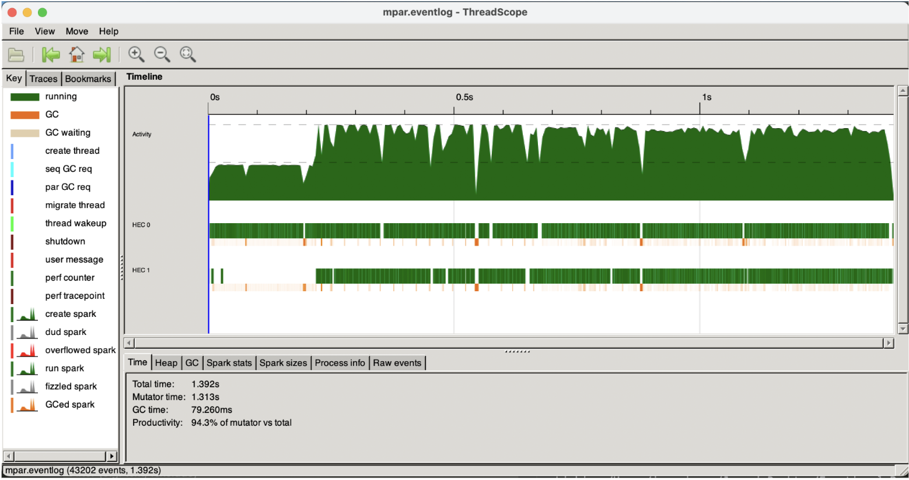
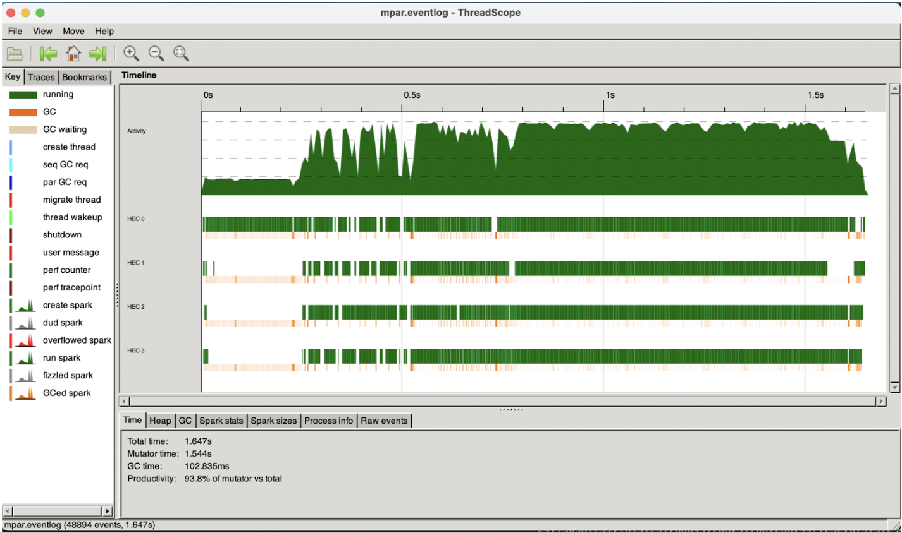

# Hello Neighbor Final Report

Kevin Jiang (kfj2112), Joshua Zhou (jz3311), Jeannie Ren (jr3766)

## Background
### Problem
The Nearest Neighbors Search (NNS) algorithm is one of the most natural ML algorithms. The search identifies a training data point that is closest to the desired point. Nearest Neighbor algorithms rely on the underlying assumption that the nearest datapoint within the training set provides useful information. NNS has been applied to problems such as data mining, recommendation systems, pattern recognition, data compression, and databases [[1]](#1) [[2]](#2) [[3]](#3) [[6]](#6) [[7]](#7).

More formally, we can define this problem for a metric space $(M, d)$, which consists of a set of points $y \in M$ and a distance metric $d: M\times M \rightarrow \mathbb{R}^+$. The distance metric must uphold the triangle inequality $d(x, z) \le d(x, y) + d(y, z)$ and symmetry $d(x, y) = d(y, x)$, and it must satisfy $d(x,y) = 0 \Leftrightarrow x=y$. With this, the nearest neighbor is defined as:

```math
NN(x) = \min_{y \in M} d(x, y)
```

A very concrete example is given a set $S$ of $n$ vectors $S \in \mathbb{R}^d$, we want to find the nearest vector to $\vec{x}$ using the Euclidean distance. A naive way to do this would be to compute the Euclidean distance for every vector in $S$. This takes $O(nd)$ time.

### Problem Formulation
This runtime can pose a problem when considering a very computationally expensive distance metric $d$ that dominates other steps, such as the Euclidean distance for a huge vector. Additionally, data structures such as $k\text{-}d$ trees break down if the "points" exist in an exotic space that don't behave like $\mathbb{R}^n$. An example of this is a set of vertices in a graph and the shortest-path.

The linear approximating and eliminating search algorithm (LAESA) algorithm [[5]](#5) achieves $O(1)$ distance computations and $O(n + d\ \text{log}(n))$ time complexity ($d$  is the time to calculate the distance and doesn't grow with $n$). Another benefit is that it only requires loading $O(1)$ data into memory outside of preprocessing, as we only need to load the data point for the distance computation. However, a drawback is the linear preprocessing cost, which is $O(n)$ distance computations.

The way we accomplish NNS is by eliminitating candidates by finding a lower bound for their distance without explicitly computing the distance to a point $t$, instead using preprocessed distances [[4]](#4). We do this by using  properties of the triangle inequality. Given a target $t$, candidate $c$, and an active candidate $a$ whose distance to $t$ we know, the lower bound $d(t, c)$ is:

```math
\begin{align}
d(t, a) &\le d(t, c) + d(a, c) \\
d(t, a) - d(a, c) &\le d(t, c)\\
\end{align}
```
By symmetry:
```math
\begin{align}
d(a, c) &\le  d(t, a) + d(t, c)\\
d(a, c) - d(t, a) &\le d(t, c)\\
& \therefore \\
|d(t, a) - d(a, c)| &\le d(t,c)\\
\end{align}
```

For a visual representation where $t$ is the target, $b$ is the best match so far, $a$ is the "active" candidate, and $c$ is another candidate being considered:

<p align="center"></p>

Once we have our lower bounds, we go through the lower bounds in ascending order and compute the actual distance. Once the lower bounds of data exceeds the lowest distance so far, that means there's no way the subsequent data is better than what we've seen. This step should happen in a constant number of comparisons.

## How to Run
### Download data
Download [siftsmall.tar.gz](http://corpus-texmex.irisa.fr/) (or any of the datasets) and create a directory called data with its contents.

### Compile the Binaries
If you want to compile the binaries and run them,
run `stack --copy-bins --local-bin-path bin install`, and it will create a bin folder locally

### Use ThreadScope
Here's how to use ThreadScope to look at parallel performance (with mpar).
First, clone the [ThreadScope repo](https://github.com/haskell/ThreadScope/releases). Then,
1. `cabal new-build --enable-profiling`
2. `NUM_TRAIN=2000 NUM_QUERY=50 NUM_BASES=50 cabal exec -- mpar +RTS -N -l -RTS`, where -N indicates the number of cores. Feel free to adjust NUM_TRAIN, NUM_QUERY, and NUM_BASES.
3. `threadscope mpar.eventlog`

## Experiments
We present a sequential LAESA and a parallel LAESA and compare them with respect to time using siftsmall_base from the [Approximate Nearest Neighbors datasets](http://corpus-texmex.irisa.fr/). We have benchmarked the algorithm by selecting subsets of the dataset and by subsequent searches (exclusive of preprocessing). The dataset we used consisted of 10k training, and 100 query vectors, both of which are 128 dimensional. We validated our experimental results with our reference code found in `python_ref.py` of our github.

All parameters of the parallelized algorithm (such as parBuffer sizes) were tuned on an M1 macbook pro. Different machines and different tuning methods may yield better results.

First, we compared how increasing the number of cores affects run-time using the runtime flags `+RTS -N${NUM_CORES}`. We found that setting `-N6` had the best performance and saw diminishing returns from there on out on an 8 core macboook pro. Higher cores indicated diminishing returns, likely from scheduling overhead. We conducted the subsequent following tests on 6 cores because we saw diminishing returns after 6 cores.
![[photos/cores.png]]

Then, we compared the speed up across the number of training vectors. We looked at 20 values linearly spaced range of [100, 5000] training vectors. We started at 100 because we need a decent number of vectors to train LAESA, but stopped at 5000 because we didn't want the subsequent steps to take too long. $n$-sized training set was used with 250 basis vectors and 25 query vectors

![[photos/training.png]]

Next, we compared the speed up across the number of query vectors (number of subsequent searches). We looked at 20 groups of search vectors of sizes [1, 100]. We plot our results below. $q$ query vectors were used with 2000 training vectors and 250 basis vectors.

![[photos/query.png]]

Finally, we compared against the number of basis vectors, direct distance computation vectors. For a metric space, these vectors are the most important for LAESA. We compared increasing and decreasing the basis count at 20 values spaced evenly in [100, 1000] for a training set of 2000. We stopped at 1000 because we didn't want $k$ basis to approach $n$ training size. $k$ training vectors were used with 2000 training vectors and 25 query vectors

![[photos/basis.png]]

### Total Runtime
On `-O2` optimization, the parallelized version of LAESA consistently outperforms the sequential implementation of LAESA. Some exceptions to this are at very low sample sizes of training vectors, because the overhead of creating new threads outweighs the computational benefit the thread would provide.

Another interesting note is we had to strategically fine-tune our number of threads: spawning too many lead to significant GC times due to there being too many threads for memory, meaning we had to limit the number of spawned threads by tuning. In fact, earlier versions included a parallelized euclidean distance that was removed since it was called semi-frequently and spawned too many threads and caused too much overhead. The existing lazy implementation worked just fine surprisingly.

Another thing of note is that the threaded applications have higher variance in their performance graphs. That's because of the "non-deterministic" behavior of the scheduler.

Finally, the number of query experiment demonstrates the best scaling, likely because the prediction is completely in parallel. Basis performed the worst because the basis training step is a greedy algorithm and cannot be parallelized.

### Threadscope Analysis
With two cores:
<p align="center"></p>
With four cores:
<p align="center"></p>

Notably, there appears to be 3 separate sections of the Threadscope graphs:
1. Dataloading, this step is indicated without parallelism
2. Training, this step has some parallelism but the greedy algorithm limits to what extend the training is parallel. Thus, we see some parallelism in the multiple threads with interruptions to sync up the greedy algorithm.
3. Predictions, We predict for approximately 25 vectors completely in parallel for all the threads. This is the "extremely parallel" step noted in our presentation.

## Reflection & Discussion
### Challenges
We faced several challenges, including initially encountering a slower parallel LAESA runtime than sequential LAESA. We resolved this by tuning the input parallelization parameters--knowing how much parallelism is tricky (Parallel Euclidean distance). We also had issue loading a custom file format and ultimately parsed the file successfully by using [Data.Binary.Get](https://hackage.haskell.org/package/binary-0.8.9.1/docs/Data-Binary-Get.html). Lastly, we had some trouble setting up ThreadScope, but was able to resolve this by cloning the binaries directly from the ThreadScope repo (mentioned above).

### Next Steps
We can implement a parallel K-Nearest Neighbors (KNN) LAESA algorithm. We also want to tune the parameters more and include better tests for the performance of the algorithm. Lastly, we want to parallelize the distance metrics.

## References

<a id="1">[1]</a>  T. Cover and P. Hart, “Nearest neighbor pattern classification,” IEEE Trans. Inf. Theory, vol. 13, no. 1, pp. 21–27, Jan. 1967, doi: 10.1109/TIT.1967.1053964.

<a id="2">[2]</a>  D. A. Adeniyi, Z. Wei, and Y. Yongquan, “Automated web usage data mining and recommendation system using K-Nearest Neighbor (KNN) classification method,” Applied Computing and Informatics, vol. 12, no. 1, pp. 90–108, Jan. 2016, doi: 10.1016/j.aci.2014.10.001.

<a id="3">[3]</a>  R. Jia et al., “Efficient Task-Specific Data Valuation for Nearest Neighbor Algorithms,” arXiv, Aug. 2019, doi: 10.48550/arXiv.1908.08619.

<a id="4">[4]</a>  M. L. Mico, J. Oncina, and E. Vidal, “A new version of the nearest-neighbour approximating and eliminating search algorithm (AESA) with linear preprocessing time and memory requirements,”Pattern Recognition Letters, vol. 15, no. 1, pp. 9–17, Jan. 1994, doi: 10.1016/0167-8655(94)90095-7.

<a id="5">[5]</a>  M. L. Mico, J. Oncina, and E. Vidal, “A new version of the nearest-neighbour approximating and eliminating search algorithm (AESA) with linear preprocessing time and memory requirements,” Pattern Recognition Letters, vol. 15, no. 1, pp. 9-17, Jan. 1994, doi: 10.1016/0167-8655(94)90095-7.

<a id="6">[6]</a> https://www.mpeg.org/standards/MPEG-2/

<a id="7">[7]</a>  https://www.pinecone.io/learn/series/faiss/vector-indexes/

