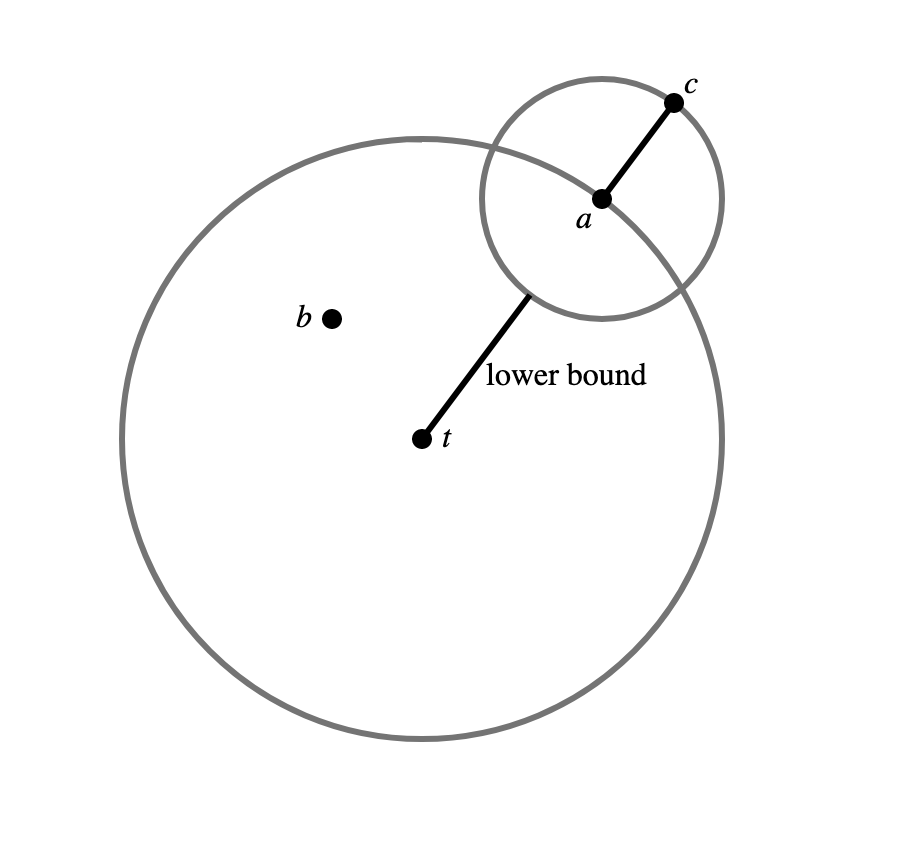

# Hello Neighbor

Kevin Jiang (kfj2112), Joshua Zhou (jz3311), Jeannie Ren (jr3766)

## Problem
The Nearest Neighbors Search (NNS) algorithm is one of the most natural ML algorithms. The search identifies a training data point that is closest to the desired point. Nearest Neighbor algorithms rely on the underlying assumption that the nearest datapoint within the training set provides useful information. NNS has been applied to problems such as data mining, recommendation systems, pattern recognition, data compression, and databases [[1]](#1) [[2]](#2) [[3]](#3) [[6]](#6) [[7]](#7).

More formally, we can define this problem for a metric space $(M, d)$, which consists of a set of points $y \in M$ and a distance metric $d: M\times M \rightarrow \mathbb{R}^+$. The distance metric must uphold the triangle inequality $d(x, z) \le d(x, y) + d(y, z)$ and symmetry $d(x, y) = d(y, x)$, and it must satisfy $d(x,y) = 0 \Leftrightarrow x=y$. With this, the nearest neighbor is defined as:

```math
NN(x) = \min_{y \in M} d(x, y)
```

A very concrete example is given a set $S$ of $n$ vectors $S \in \mathbb{R}^d$, we want to find the nearest vector to $\vec{x}$ using the Euclidean distance. A naive way to do this would be to compute the Euclidean distance for every vector in $S$. This takes $O(nd)$ time.

## Problem Formulation
This runtime can pose a problem when considering a very computationally expensive distance metric $d$ that dominates other steps, such as the Euclidean distance for a huge vector. Additionally, data structures such as $k\text{-}d$ trees break down if the "points" exist in an exotic space that don't behave like $\mathbb{R}^n$. An example of this is a set of vertices in a graph and the shortest-path.

The linear approximating and eliminating search algorithm (LAESA) algorithm [[5]](#5) achieves $O(1)$ distance computations and $O(n + d\ \text{log}(n))$ time complexity ($d$  is the time to calculate the distance and doesn't grow with $n$). Another benefit is that it only requires loading $O(1)$ data into memory outside of preprocessing, as we only need to load the data point for the distance computation. However, a drawback is the linear preprocessing cost, which is $O(n)$ distance computations.

The way we accomplish NNS is by eliminitating candidates by finding a lower bound for their distance without explicitly computing the distance to a point $t$, instead using preprocessed distances [[4]](#4). We do this by using  properties of the triangle inequality. Given a target $t$, candidate $c$, and an active candidate $a$ whose distance to $t$ we know, the lower bound $d(t, c)$ is:

```math
\begin{align}
d(t, a) &\le d(t, c) + d(a, c) \\
d(t, a) - d(a, c) &\le d(t, c)\\
\end{align}
```
By symmetry:
```math
\begin{align}
d(a, c) &\le  d(t, a) + d(t, c)\\
d(a, c) - d(t, a) &\le d(t, c)\\
& \therefore \\
|d(t, a) - d(a, c)| &\le d(t,c)\\
\end{align}
```

For a visual representation where $t$ is the target, $b$ is the best match so far, $a$ is the "active" candidate, and $c$ is another candidate being considered:

<p align="center"></p>

Once we have our lower bounds, we go through the lower bounds in ascending order and compute the actual distance. Once the lower bounds of data exceeds the lowest distance so far, that means there's no way the subsequent data is better than what we've seen. This step should happen in a constant number of comparisons.

## Targets for Improvement
There are multiple steps that can be parallelized.

1. Computing the inter-candidate distances during preprocessing
2. Computing the lower bounds between a target and a candidate during searching

These help "erase" an inner-loop in both the preprocessing and search steps.

## Deliverables
A sequential and parallel LAESA with benchmarks w.r.t. time using one of the [Approximate Nearest Neighbors datasets](http://corpus-texmex.irisa.fr/) or something similar. We can benchmark the algorithm by selecting subsets of the dataset. Additionally, we'd like to benchmark subsequent searches (exclusive of preprocessing). Finally, we also want see how many distance calls are actually called during a search and if that changes with the dataset size.

## Python Reference
```python
class Laesa[T]:
    """Computes approximate Nearest Neighbor with linear preprocessing.

    References
    ----------
    .. [1] M. L. Mico, J. Oncina, and E. Vidal,
        “A new version of the nearest-neighbour approximating and eliminating search algorithm (AESA) with linear preprocessing time and memory requirements,”
        Pattern Recognition Letters, vol. 15, no. 1, pp. 9-17, Jan. 1994, doi: 10.1016/0167-8655(94)90095-7.
    .. [2] F. Moreno-Seco, L. Mico, and J. Oncina,
        “A modification of the LAESA algorithm for approximated k-NN classification,”
        Pattern Recognition Letters, vol. 24, no. 1, pp. 47-53, Jan. 2003, doi: 10.1016/S0167-8655(02)00187-3.

    Parameters
    ----------
    candidates : list[T]
        List of candidates for a neighbor. Referred to as the set of all points $M$.
    distance : Callable[[T, T], float]
        Distance metric between candidates T, referred to as $d$ for a metric space.
    num_bases : int, optional
        To limit the number of inter-candidate distance calculated, we only compute the
        inter-candidate distance distances for the bases in the preprocessing. Selecting
        `num_bases` of bases is done by maximizing the distances between, by default 25
    """

    def __init__(
        self, candidates: list[T], distance: Callable[[T, T], float], num_bases: int=25
    ):
        self.dist = distance
        self.candidates = candidates
        self.num_candidates = len(candidates)
        self.num_bases = num_bases

        # Used for LAESA aglorithim, we compute the distance between every point to the
        # base candidates so we can narrow our search with the traingle inequality
        self.base_indices = [random.choice(range(self.num_candidates))]  # arbitrary
        self.base_dist = [
            [0 for _ in range(self.num_candidates)] for _ in range(num_bases)
        ]
        lower_bounds = [0 for _ in range(self.num_candidates)]

        for i in range(num_bases):
            current_base = candidates[self.base_indices[i]]
            max_dist_index = 0

            for j in range(self.num_candidates):  # TODO this step is parallelizable
                if j in self.base_indices or self.base_indices[i] == j:  # d(x, x) = 0
                    continue

                self.base_dist[i][j] = self.dist(current_base, candidates[j])
                lower_bounds[j] += self.base_dist[i][j]
                # We want the next base to be as far from the others as possible
                max_dist_index = max(j, max_dist_index, key=lambda k: lower_bounds[k])

            self.base_indices.append(max_dist_index)
        self.base_indices.pop()  # Removes last base as we don't compute distances

    def predict(self, target: T) -> T:
        # TODO parellize
        target_dist = [self.dist(target, self.candidates[p]) for p in self.base_indices]

        # Computes initial guess lower bounds  TODO this step is parallelizable
        def compute_lb(j: int) -> float:
            """Computes highest lb using the triangle inequality and the bases."""
            return max(
                abs(target_dist[i] - self.base_dist[i][j]) for i in range(self.num_bases)
            )
        lower_bounds = [compute_lb(j) for j in range(self.num_candidates)]

        base_index = min(range(self.num_bases), key=lambda i: target_dist[i])
        best_dist = target_dist[base_index]
        best_candidate = self.base_indices[base_index]

        # We assume our lowerbounds total ordering is approximately correct
        # The heap ensures that all further lower bounds are greater than the best dist
        # Heapify is O(n) and this value should converge in O(1) steps
        lb_heap = Heap(range(self.num_candidates), key=lambda i: lower_bounds[i])
        while lb_heap and lower_bounds[lb_heap.peak()] <= best_dist:
            cand_index = lb_heap.pop()
            if (new_dist := self.dist(self.candidates[cand_index], target)) < best_dist:
                best_dist, best_candidate = new_dist, cand_index

        return self.candidates[best_candidate]

```

## Further Discussion
A $k$-NN algorithm would be a not-too-difficult modification to the project, as instead of tracking the best candidates, we would also track the top $k$ candidates with another heap. Further, we could compare it against AESA, which has a quadratic preprocessing cost.

## References

<a id="1">[1]</a>  T. Cover and P. Hart, “Nearest neighbor pattern classification,” IEEE Trans. Inf. Theory, vol. 13, no. 1, pp. 21–27, Jan. 1967, doi: 10.1109/TIT.1967.1053964.

<a id="2">[2]</a>  D. A. Adeniyi, Z. Wei, and Y. Yongquan, “Automated web usage data mining and recommendation system using K-Nearest Neighbor (KNN) classification method,” Applied Computing and Informatics, vol. 12, no. 1, pp. 90–108, Jan. 2016, doi: 10.1016/j.aci.2014.10.001.

<a id="3">[3]</a>  R. Jia et al., “Efficient Task-Specific Data Valuation for Nearest Neighbor Algorithms,” arXiv, Aug. 2019, doi: 10.48550/arXiv.1908.08619.

<a id="4">[4]</a>  M. L. Mico, J. Oncina, and E. Vidal, “A new version of the nearest-neighbour approximating and eliminating search algorithm (AESA) with linear preprocessing time and memory requirements,”Pattern Recognition Letters, vol. 15, no. 1, pp. 9–17, Jan. 1994, doi: 10.1016/0167-8655(94)90095-7.

<a id="5">[5]</a>  M. L. Mico, J. Oncina, and E. Vidal, “A new version of the nearest-neighbour approximating and eliminating search algorithm (AESA) with linear preprocessing time and memory requirements,” Pattern Recognition Letters, vol. 15, no. 1, pp. 9-17, Jan. 1994, doi: 10.1016/0167-8655(94)90095-7.

<a id="6">[6]</a> https://www.mpeg.org/standards/MPEG-2/

<a id="7">[7]</a>  https://www.pinecone.io/learn/series/faiss/vector-indexes/

