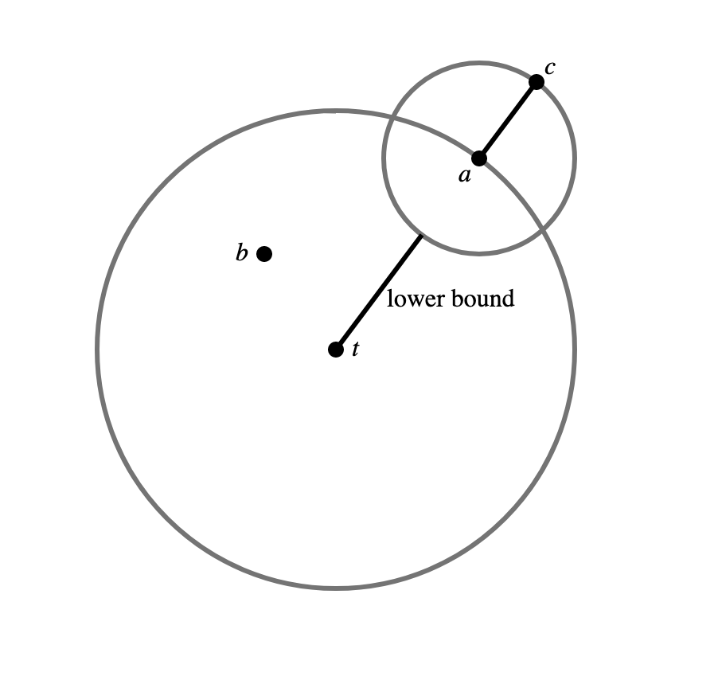

# Hello Neighbor Final Report

Kevin Jiang (kfj2112), Joshua Zhou (jz3311), Jeannie Ren (jr3766)

## Background
### Problem
The Nearest Neighbors Search (NNS) algorithm is one of the most natural ML algorithms. The search identifies a training data point that is closest to the desired point. Nearest Neighbor algorithms rely on the underlying assumption that the nearest datapoint within the training set provides useful information. NNS has been applied to problems such as data mining, recommendation systems, pattern recognition, data compression, and databases [[1]](#1) [[2]](#2) [[3]](#3) [[6]](#6) [[7]](#7).

More formally, we can define this problem for a metric space $(M, d)$, which consists of a set of points $y \in M$ and a distance metric $d: M\times M \rightarrow \mathbb{R}^+$. The distance metric must uphold the triangle inequality $d(x, z) \le d(x, y) + d(y, z)$ and symmetry $d(x, y) = d(y, x)$, and it must satisfy $d(x,y) = 0 \Leftrightarrow x=y$. With this, the nearest neighbor is defined as:

```math
NN(x) = \min_{y \in M} d(x, y)
```

A very concrete example is given a set $S$ of $n$ vectors $S \in \mathbb{R}^d$, we want to find the nearest vector to $\vec{x}$ using the Euclidean distance. A naive way to do this would be to compute the Euclidean distance for every vector in $S$. This takes $O(nd)$ time.

### Problem Formulation
This runtime can pose a problem when considering a very computationally expensive distance metric $d$ that dominates other steps, such as the Euclidean distance for a huge vector. Additionally, data structures such as $k\text{-}d$ trees break down if the "points" exist in an exotic space that don't behave like $\mathbb{R}^n$. An example of this is a set of vertices in a graph and the shortest-path.

The linear approximating and eliminating search algorithm (LAESA) algorithm [[5]](#5) achieves $O(1)$ distance computations and $O(n + d\ \text{log}(n))$ time complexity ($d$  is the time to calculate the distance and doesn't grow with $n$). Another benefit is that it only requires loading $O(1)$ data into memory outside of preprocessing, as we only need to load the data point for the distance computation. However, a drawback is the linear preprocessing cost, which is $O(n)$ distance computations.

The way we accomplish NNS is by eliminitating candidates by finding a lower bound for their distance without explicitly computing the distance to a point $t$, instead using preprocessed distances [[4]](#4). We do this by using  properties of the triangle inequality. Given a target $t$, candidate $c$, and an active candidate $a$ whose distance to $t$ we know, the lower bound $d(t, c)$ is:

```math
\begin{align}
d(t, a) &\le d(t, c) + d(a, c) \\
d(t, a) - d(a, c) &\le d(t, c)\\
\end{align}
```
By symmetry:
```math
\begin{align}
d(a, c) &\le  d(t, a) + d(t, c)\\
d(a, c) - d(t, a) &\le d(t, c)\\
& \therefore \\
|d(t, a) - d(a, c)| &\le d(t,c)\\
\end{align}
```

For a visual representation where $t$ is the target, $b$ is the best match so far, $a$ is the "active" candidate, and $c$ is another candidate being considered:

<p align="center"></p>

Once we have our lower bounds, we go through the lower bounds in ascending order and compute the actual distance. Once the lower bounds of data exceeds the lowest distance so far, that means there's no way the subsequent data is better than what we've seen. This step should happen in a constant number of comparisons.


## Experiments
TODO:
We present a sequential LAESA and a parallel LAESA and compare them with respect to time using siftsmall_base from the [Approximate Nearest Neighbors datasets](http://corpus-texmex.irisa.fr/). We have benchmarked the algorithm by selecting subsets of the dataset and by subsequent searches (exclusive of preprocessing). Finally, we also want see how many distance calls are actually called during a search and if that changes with the dataset size.

## Results & Analysis

### Total Runtime
TODO: finish analysis
Depending on the number of threads, the runtime can be reduced. 

### Threadscope Analysis
TODO: insert images

### Runtime Analysis on Predict Calls
TODO

## Reflection & Discussion
TODO

## References

<a id="1">[1]</a>  T. Cover and P. Hart, “Nearest neighbor pattern classification,” IEEE Trans. Inf. Theory, vol. 13, no. 1, pp. 21–27, Jan. 1967, doi: 10.1109/TIT.1967.1053964.

<a id="2">[2]</a>  D. A. Adeniyi, Z. Wei, and Y. Yongquan, “Automated web usage data mining and recommendation system using K-Nearest Neighbor (KNN) classification method,” Applied Computing and Informatics, vol. 12, no. 1, pp. 90–108, Jan. 2016, doi: 10.1016/j.aci.2014.10.001.

<a id="3">[3]</a>  R. Jia et al., “Efficient Task-Specific Data Valuation for Nearest Neighbor Algorithms,” arXiv, Aug. 2019, doi: 10.48550/arXiv.1908.08619.

<a id="4">[4]</a>  M. L. Mico, J. Oncina, and E. Vidal, “A new version of the nearest-neighbour approximating and eliminating search algorithm (AESA) with linear preprocessing time and memory requirements,”Pattern Recognition Letters, vol. 15, no. 1, pp. 9–17, Jan. 1994, doi: 10.1016/0167-8655(94)90095-7.

<a id="5">[5]</a>  M. L. Mico, J. Oncina, and E. Vidal, “A new version of the nearest-neighbour approximating and eliminating search algorithm (AESA) with linear preprocessing time and memory requirements,” Pattern Recognition Letters, vol. 15, no. 1, pp. 9-17, Jan. 1994, doi: 10.1016/0167-8655(94)90095-7.

<a id="6">[6]</a> https://www.mpeg.org/standards/MPEG-2/

<a id="7">[7]</a>  https://www.pinecone.io/learn/series/faiss/vector-indexes/

